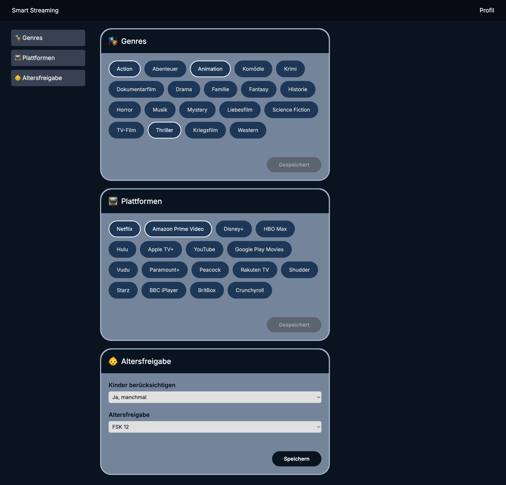

# Personalized Movie Recommendations through Chatbot Interaction

This project was developed as part of my Master's thesis.  
It is a **Next.js web application** that integrates a **CopilotKit chatbot**.  
The chatbot guides users through preference selection (e.g. genres, platforms) and provides **personalized movie recommendations** based on stored preferences and dynamic inputs.

## ✨ Features
- Chatbot interaction with prompt-engineered conversation flow
- Personalized movie recommendations from TMDb API
- User profile management for editing and saving preferences
- Dynamic UI adjustments based on user input

## 🖼️ Screenshots

**Start page**  


**Profile page**  



## 🛠️ Tech Stack
- [Next.js](https://nextjs.org/)
- [CopilotKit](https://copilotkit.ai/)
- [MongoDB](https://www.mongodb.com/)
- [TMDb API](https://www.themoviedb.org/documentation/api)
- [OpenAI GPT-4o](https://openai.com)

## 🚀 Getting Started

First, run the development server:

```bash
npm run dev
# or
yarn dev
# or
pnpm dev
# or
bun dev
```

Open [http://localhost:3000](http://localhost:3000) with your browser to see the result.

You can start editing the page by modifying `app/page.tsx`. The page auto-updates as you edit the file.

This project uses [`next/font`](https://nextjs.org/docs/basic-features/font-optimization) to automatically optimize and load Inter, a custom Google Font.

## Learn More

To learn more about Next.js, take a look at the following resources:

- [Next.js Documentation](https://nextjs.org/docs) - learn about Next.js features and API.
- [Learn Next.js](https://nextjs.org/learn) - an interactive Next.js tutorial.

You can check out [the Next.js GitHub repository](https://github.com/vercel/next.js/) - your feedback and contributions are welcome!

## Deploy on Vercel

The easiest way to deploy your Next.js app is to use the [Vercel Platform](https://vercel.com/new?utm_medium=default-template&filter=next.js&utm_source=create-next-app&utm_campaign=create-next-app-readme) from the creators of Next.js.

Check out our [Next.js deployment documentation](https://nextjs.org/docs/deployment) for more details.
